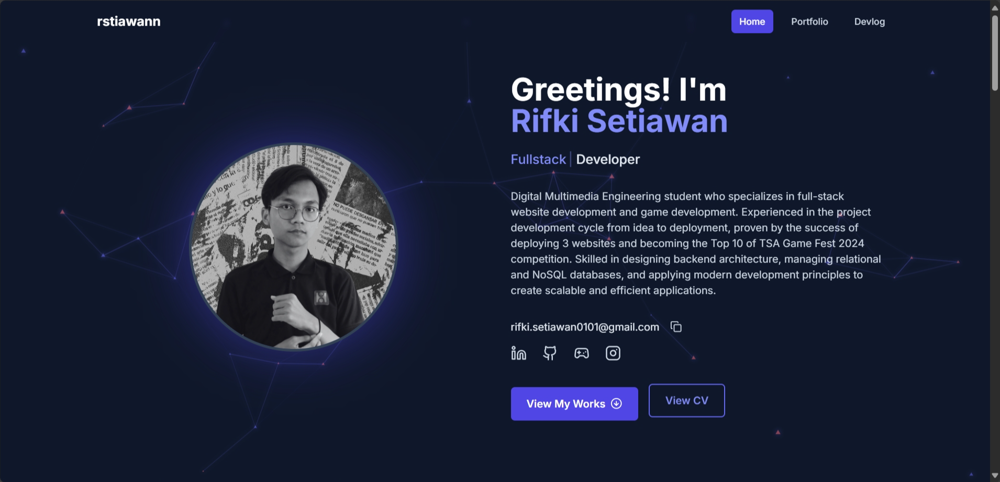
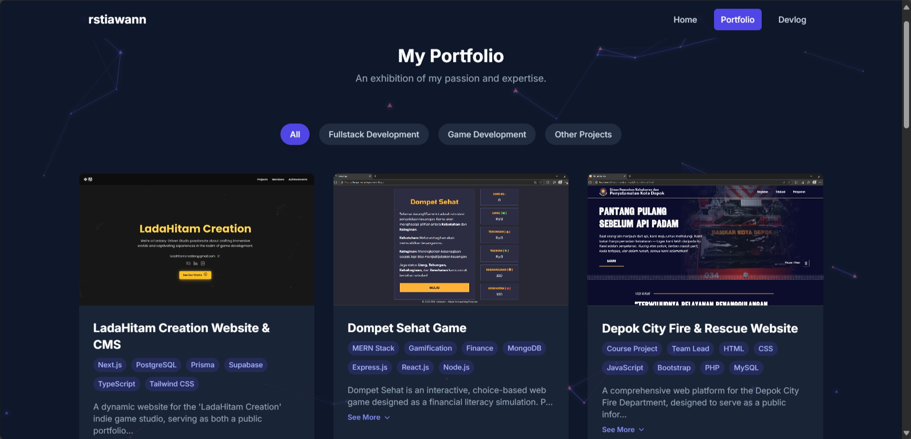
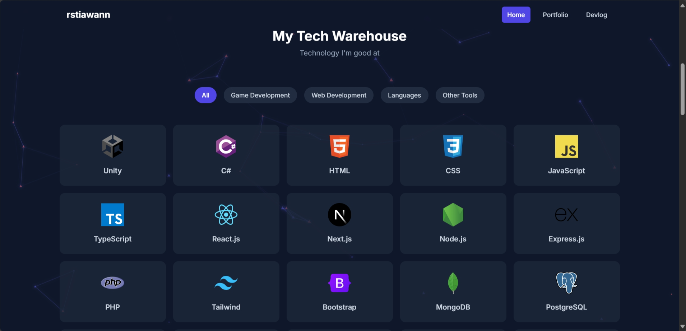
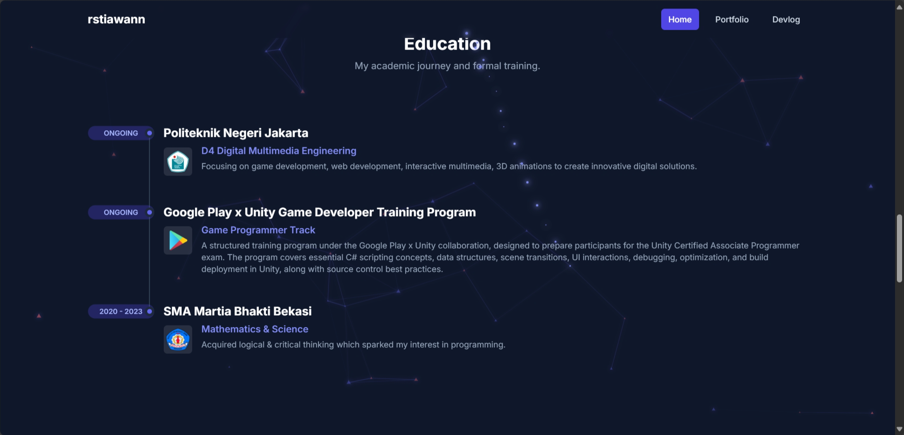
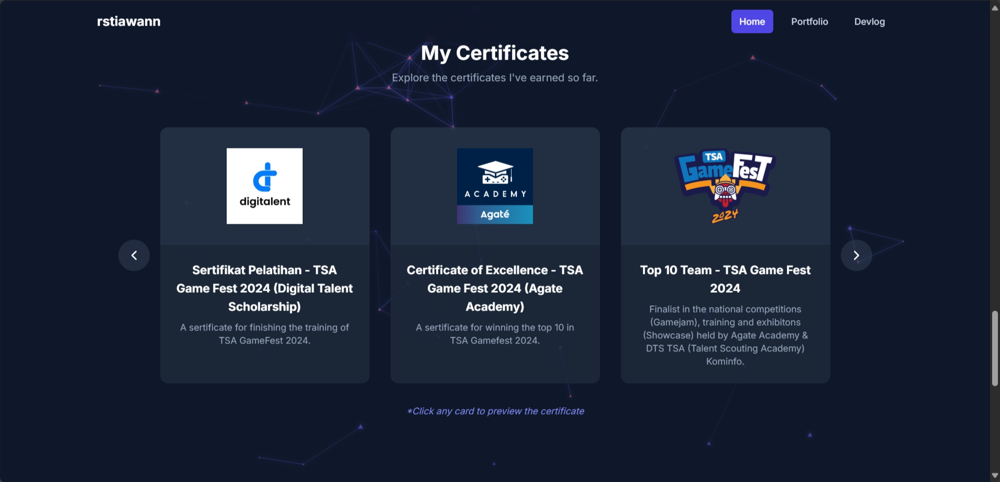
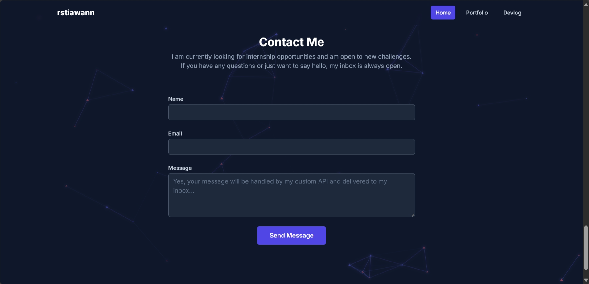

# 🚀 Rifki Setiawan - Next.js Personal Portfolio 🚀

## ✨ Demo

You can view the live portfolio here: [**rstiawann.vercel.app**](https://rstiawann.vercel.app/)

## 📖 Overview

This repository contains the new, upgraded version of my personal portfolio, completely rebuilt from the ground up with **Next.js** and the **App Router**. The migration from Create React App was a strategic decision to leverage the power of **Server-Side Rendering (SSR)** for vastly improved SEO and initial page load performance.

This full-stack application now features a more robust and scalable architecture, with data served from a **PostgreSQL** database on Supabase and managed via **Prisma ORM**. The backend logic, including the contact form API, is handled seamlessly by Next.js Route Handlers, all deployed on Vercel.

## 💻 Technology Stack

This project leverages a modern, server-first, and highly performant technology stack.

**Framework & Frontend:**

**Backend, Database & Deployment:**

## ⚙️ Core Features & Improvements

This portfolio enhances the features of the original version with a more powerful backend and architecture:

* **Superior Performance & SEO:**
    * Built with the **Next.js App Router**, utilizing **Server Components** to fetch data directly from the database, minimizing client-side load times.
    * **Server-Side Rendering (SSR)** ensures that content is fully rendered on the server, making it highly indexable by search engines like Google.
    * **Dynamic Metadata API** for page-specific titles, descriptions, and rich social media previews (Open Graph & Twitter Cards).

* **Robust Backend & Database:**
    * **PostgreSQL Database:** Migrated from MongoDB to a relational PostgreSQL database hosted on **Supabase** for structured and reliable data management.
    * **Prisma ORM:** Integrated Prisma for type-safe database queries, making data access more predictable and efficient.
    * **Next.js Route Handlers:** The custom API for the contact form is now built with Route Handlers, providing a clean and integrated backend solution.

* **Dynamic & Interactive UI:**
    * **Particle Background:** Retains the animated, interactive particle background from `tsParticles`.
    * **Custom Mouse Trail:** The glowing cursor trail effect remains for an enhanced user experience.
    * **Rich Animations:** Complex animations and page transitions are handled by **Framer Motion**.

* **Full-Stack Functionality:**
    * **Database Integration:** All portfolio content (skills, projects, education, etc.) is now dynamically fetched from the PostgreSQL database.
    * **Resend API Integration:** The contact form securely saves messages to the database and triggers a real-time email notification via the Resend API.

## 📸 Screenshots

**Home Section**

**Portfolio**

**Skills Section**

**Education Section**

**Achievement Section**

**Contact Section**

## 📄 License

This project is licensed under the Apache 2.0 License. See [LICENSE](LICENSE) for details.

## 🙏 Credits

**Rifki Setiawan** 👨‍💻 Full Stack Developer & Game Programmer ([GitHub](https://github.com/rifkisetiawan0101))

---

Thanks for visiting my project repository! ✨
